# Project Architecture & Flow

This knowledge graph visualizes the code structure, modules, and their dependencies within the QDArchive project.
Internal modules are shown in blue, and external dependencies in green.

```mermaid
graph TD
    %% Styling
    classDef internal fill:#3b82f6,stroke:#1d4ed8,stroke-width:2px,color:#fff;
    classDef external fill:#10b981,stroke:#047857,stroke-width:2px,color:#fff;
    subgraph QDArchive Architecture
    harvester_base["harvester_base"]:::internal
    db["db"]:::internal
    config["config"]:::internal
    downloader["downloader"]:::internal
    constants["constants"]:::internal
    dashboard["dashboard"]:::internal
    oai_common["oai_common"]:::internal
    main["main"]:::internal
    zenodo_harvester["zenodo_harvester"]:::internal
    cessda_harvester["cessda_harvester"]:::internal
    icpsr_harvester["icpsr_harvester"]:::internal
    __init__["__init__"]:::internal
    generic_dataverse_harvester["generic_dataverse_harvester"]:::internal
    ihsn_harvester["ihsn_harvester"]:::internal
    odum_harvester["odum_harvester"]:::internal
    dryad_harvester["dryad_harvester"]:::internal
    sada_harvester["sada_harvester"]:::internal
    %% Dependencies
    aiohttp[[aiohttp]]:::external
    harvester_base -.-> aiohttp
    abc[[abc]]:::external
    harvester_base -.-> abc
    asyncio[[asyncio]]:::external
    harvester_base -.-> asyncio
    __future__[[__future__]]:::external
    harvester_base -.-> __future__
    db --> config
    aiosqlite[[aiosqlite]]:::external
    db -.-> aiosqlite
    db -.-> asyncio
    db -.-> __future__
    dotenv[[dotenv]]:::external
    config -.-> dotenv
    config -.-> __future__
    dataclasses[[dataclasses]]:::external
    config -.-> dataclasses
    downloader --> config
    tarfile[[tarfile]]:::external
    downloader -.-> tarfile
    downloader -.-> aiohttp
    shutil[[shutil]]:::external
    downloader -.-> shutil
    downloader -.-> asyncio
    downloader --> constants
    downloader -.-> __future__
    tempfile[[tempfile]]:::external
    downloader -.-> tempfile
    zipfile[[zipfile]]:::external
    downloader -.-> zipfile
    constants -.-> __future__
    dashboard --> config
    dashboard -.-> __future__
    sqlite3[[sqlite3]]:::external
    dashboard -.-> sqlite3
    xml[[xml]]:::external
    oai_common -.-> xml
    urllib[[urllib]]:::external
    oai_common -.-> urllib
    oai_common -.-> aiohttp
    oai_common -.-> asyncio
    oai_common --> constants
    yarl[[yarl]]:::external
    oai_common -.-> yarl
    oai_common -.-> __future__
    main --> config
    main --> harvester_base
    main --> downloader
    main --> db
    argparse[[argparse]]:::external
    main -.-> argparse
    main -.-> asyncio
    main --> constants
    harvesters[[harvesters]]:::external
    main -.-> harvesters
    main -.-> __future__
    zenodo_harvester --> config
    zenodo_harvester --> harvester_base
    zenodo_harvester -.-> aiohttp
    zenodo_harvester -.-> asyncio
    zenodo_harvester --> constants
    zenodo_harvester -.-> __future__
    cessda_harvester --> harvester_base
    cessda_harvester -.-> aiohttp
    cessda_harvester -.-> asyncio
    cessda_harvester --> constants
    cessda_harvester -.-> __future__
    icpsr_harvester --> harvester_base
    icpsr_harvester -.-> aiohttp
    icpsr_harvester -.-> asyncio
    icpsr_harvester --> constants
    icpsr_harvester -.-> __future__
    generic_dataverse_harvester --> harvester_base
    generic_dataverse_harvester -.-> aiohttp
    generic_dataverse_harvester -.-> asyncio
    generic_dataverse_harvester --> constants
    generic_dataverse_harvester -.-> __future__
    ihsn_harvester --> config
    ihsn_harvester --> harvester_base
    ihsn_harvester -.-> urllib
    ihsn_harvester -.-> aiohttp
    ihsn_harvester -.-> asyncio
    ihsn_harvester --> constants
    ihsn_harvester -.-> __future__
    odum_harvester --> harvester_base
    odum_harvester -.-> asyncio
    odum_harvester --> constants
    odum_harvester --> oai_common
    odum_harvester -.-> __future__
    dryad_harvester --> config
    dryad_harvester --> harvester_base
    dryad_harvester -.-> urllib
    dryad_harvester -.-> aiohttp
    concurrent[[concurrent]]:::external
    dryad_harvester -.-> concurrent
    dryad_harvester -.-> asyncio
    dryad_harvester --> constants
    dryad_harvester -.-> __future__
    sada_harvester --> config
    sada_harvester --> harvester_base
    sada_harvester -.-> urllib
    sada_harvester -.-> aiohttp
    sada_harvester -.-> asyncio
    sada_harvester --> constants
    sada_harvester -.-> __future__
    end
```

*Auto-generated by custom architecture script. Re-run `python generate_graph.py` to update after code changes.*